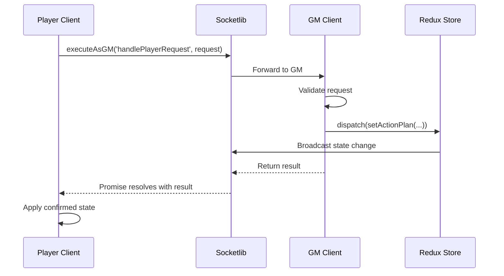
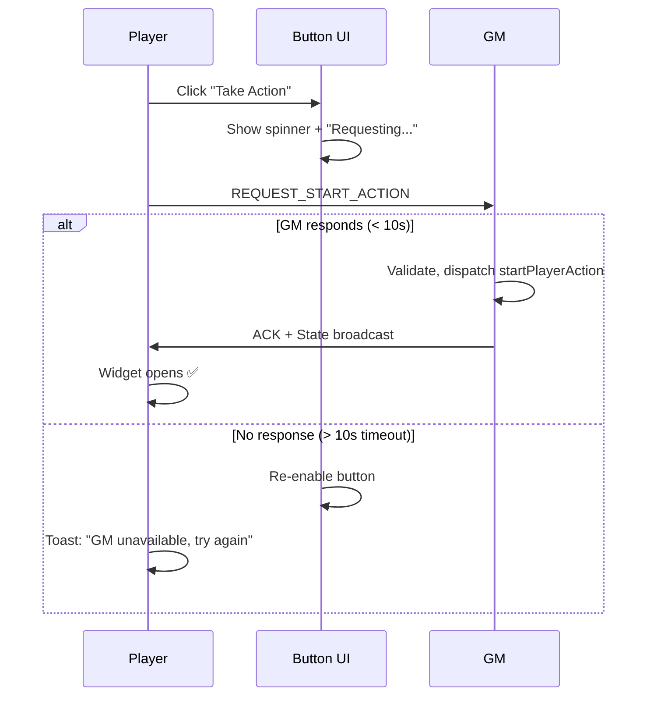
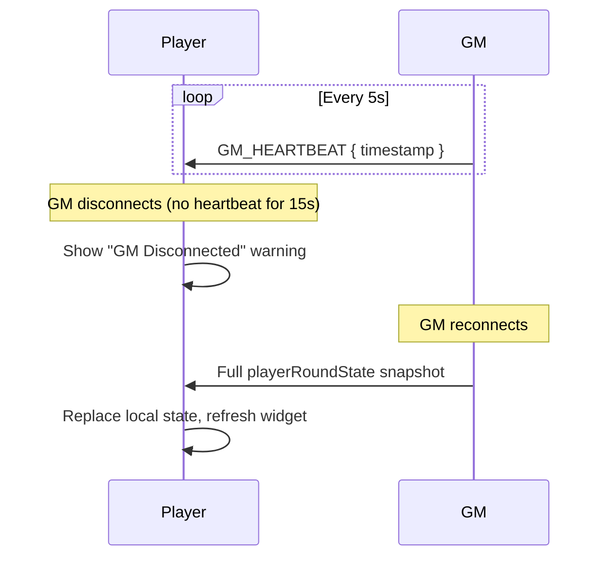

# GM-Authority RPC Architecture

This document describes the RPC (Remote Procedure Call) pattern used by the [Player Action Widget](./player-action-widget.md) for synchronizing state between GM and player clients.

## Overview

The architecture follows a **server-client model** where:
- **GM = Server**: Single source of truth, validates and dispatches all state changes
- **Player = Client**: Sends requests, receives confirmed state

This eliminates race conditions by design — only one writer (GM) can modify state.

## Transport Layer: Socketlib with Delivery Guarantee

Requests use Foundry's **socketlib** `executeAsGM()` which provides **built-in acknowledgment**:

```typescript
// Player sends request - Promise-based delivery guarantee
const socket = socketlib.registerModule('fitgd');

try {
  const result = await socket.executeAsGM('handlePlayerRequest', request);
  // ✅ GM received AND processed - result contains confirmed state
  applyConfirmedState(result);
} catch (error) {
  // ❌ GM unreachable (offline, disconnected)
  showError('GM unavailable, please retry');
}
```

**Guarantees:**
- Promise **resolves** → GM received and processed the request
- Promise **rejects** → GM never received (no silent failures)
- No need for timeout polling — socketlib handles it

## Data Flow



## RPC Message Types

### Player → GM (Requests via executeAsGM)

| Request Type | Payload | Description |
|--------------|---------|-------------|
| `REQUEST_START_ACTION` | `{ characterId }` | Player opens widget |
| `REQUEST_SET_APPROACH` | `{ approach, secondaryApproach? }` | Player selects approach |
| `REQUEST_SET_IMPROVEMENTS` | `{ pushed, flashback, ... }` | Player toggles modifiers |
| `REQUEST_ROLL` | `{}` | Player clicks Roll |
| `REQUEST_USE_STIMS` | `{}` | Player interrupts with stims |
| `REQUEST_ACCEPT_CONSEQUENCE` | `{}` | Player accepts consequence |
| `REQUEST_CLOSE_WIDGET` | `{}` | Player closes widget |

### GM → All (Broadcasts via socket.emit)

| Broadcast Type | Payload | Description |
|----------------|---------|-------------|
| State update | `{ playerRoundState, lastConfirmedRequestId, forceSync? }` | Full state after each change |
| `GM_HEARTBEAT` | `{ timestamp }` | GM connection alive signal |

## Widget Lifecycle: Strict GM-First

> [!IMPORTANT]
> The widget **only opens after GM confirms**. No optimistic widget opening.

### Opening the Widget



**Why no optimistic widget?**
- Avoids "waiting widget" that could be invalidated on GM reconnect
- No complex reconnect edge cases
- Widget always opens synchronized on both clients

## Blocking vs Optimistic Actions

> [!IMPORTANT]
> **Blocking**: Player waits for GM response before UI updates.
> **Optimistic**: Player updates local UI immediately, sends request without waiting.

### Blocking Actions (Exhaustive List)

| Action | Request Type | Why Blocking |
|--------|--------------|--------------|
| Widget open | `REQUEST_START_ACTION` | Must sync both clients |
| Widget close | `REQUEST_CLOSE_WIDGET` | Must sync both clients |
| Roll | `REQUEST_ROLL` | Results come from GM only |
| Use Stims | `REQUEST_USE_STIMS` | State transition critical |
| Accept Consequence | `REQUEST_ACCEPT_CONSEQUENCE` | Finalizes turn, irreversible |

### Optimistic Actions (Everything Else)

> [!NOTE]
> Any action **not listed above** is optimistic by default.

**Examples:**
- Select approach / secondary approach
- Toggle Push / Flashback
- Select equipment
- Trait dialog interactions
- Position/Effect changes (GM-side but same pattern)

### Optimistic Rejection Handling

When GM broadcast arrives with matching `lastConfirmedRequestId` but different state:

```typescript
if (broadcast.lastConfirmedRequestId === myLastSentRequestId) {
  if (statesDiffer(localOptimisticState, broadcast.playerRoundState)) {
    // GM rejected or modified my request
    showToast('GM adjusted your selection');
  }
  // Always apply GM's confirmed state
  applyState(broadcast.playerRoundState);
  clearOptimisticState();
}
```

## Client-Side Validation

Players run the **same validators** as GM before sending requests:

1. **Immediate feedback** — Disable buttons if validation fails locally
2. **No request sent** — Invalid requests blocked before network round-trip

```typescript
// Example: Roll validation
if (!playerState?.selectedApproach) {
  showError('Select an approach first');
  return; // Never sends REQUEST_ROLL
}
```

## Synchronization Guarantees

### Concurrent Requests & Request IDs

Players can send **multiple requests concurrently** (rapid clicking). Each request has a unique `requestId`:

```typescript
// Player sends
{ type: 'REQUEST_SET_APPROACH', payload: { approach: 'force' }, requestId: 'req-1' }
{ type: 'REQUEST_SET_APPROACH', payload: { approach: 'guile' }, requestId: 'req-2' }  // Sent immediately
```

GM processes in FIFO order and echoes back which request was confirmed.

### Full State + lastConfirmedRequestId

Every broadcast from GM includes:
1. **Complete `playerRoundState`** snapshot
2. **`lastConfirmedRequestId`** — which request triggered this broadcast

```typescript
// GM broadcasts
socket.emit('fitgd:stateUpdate', {
  playerRoundState: { /* complete state */ },
  lastConfirmedRequestId: 'req-1',  // ← Echoes which request was processed
  forceSync: false
});
```

### Player State Application Rules

> [!IMPORTANT]
> Player only applies state update if it matches their **last sent request** or has **forceSync**.

```typescript
function handleStateBroadcast(broadcast) {
  if (broadcast.forceSync) {
    // GM reconnect or explicit sync - always apply
    applyState(broadcast.playerRoundState);
    return;
  }
  
  if (broadcast.lastConfirmedRequestId === myLastSentRequestId) {
    // This is the response to MY last request - apply it
    applyState(broadcast.playerRoundState);
  }
  // else: Ignore - response to older request, I've sent newer ones
}
```

**Benefits:**
- ✅ No UI flickering — outdated broadcasts ignored
- ✅ Fast clicking works — player doesn't wait for each ACK
- ✅ `forceSync` handles reconnect scenarios
- ✅ Simple — just compare one ID, no pending queue

### GM Heartbeat & Reconnect

To prevent de-sync when GM connection drops:

### Heartbeat
- GM sends `GM_HEARTBEAT` every 5 seconds while widget is open
- Player tracks last heartbeat timestamp
- If no heartbeat for 15 seconds, player shows "GM Disconnected" warning

### Reconnect
- On GM reconnect, GM broadcasts full `playerRoundState` snapshot
- Player receives snapshot and replaces local state
- Widget refreshes to confirmed state



## Error Handling

| Scenario | Behavior |
|----------|----------|
| Invalid request (bad state transition) | GM rejects with `ACK_REQUEST { success: false, error }` |
| Insufficient momentum | GM rejects, player sees inline error |
| GM timeout (no ACK in 10s) | Player shows retry option |
| Player request during ROLLING | Request queued until state settles |

## Integration Points

- **Socket Handler**: Routes `REQUEST_*` to GM, broadcasts state changes
- **Player Action Widget**: Sends requests from player, dispatches from GM
- **Handlers**: Export validators for client-side prediction
