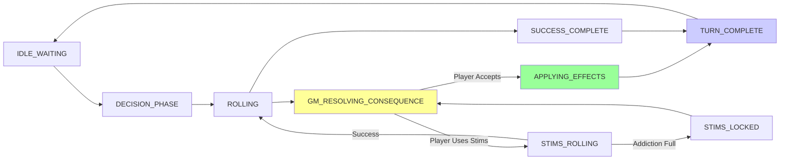

# Player Action Widget

## Overview
The **Player Action Widget** is a persistent, floating UI element that guides players through the core action resolution loop. It implements a complex state machine to handle the transition from decision-making to dice rolling, GM approval, and consequence resolution.

**Why this is critical:**
It serves as the primary interface for the game's core mechanic, enforcing rules like momentum costs, load limits, and position/effect negotiation in real-time.

## Architecture & State

### State Machine
The widget derives its UI state primarily from `playerRoundStateSlice`. The key states are:

1.  **DECISION_PHASE**:
    - **Approach Selection**: Player chooses their approach (Force, Guile, etc.).
    - **Roll Modes**:
        - **Standard**: Uses a single approach.
        - **Synergy**: Combines two approaches (Primary + Secondary) for a larger dice pool.
        - **Equipment**: Uses an item's bonus in place of a secondary approach.
    - **Modifiers**: Player can [Rally](./mechanics-rally.md), [Lean Into Traits](./mechanics-traits.md), or use [Flashbacks](./mechanics-traits.md).
    - **GM Controls**: GM sets Position and Effect.
2.  **ROLLING**:
    - System validates costs (Momentum).
    - Dice are rolled (3D dice integration).
    - Results are calculated and batched.
3.  **AWAITING_APPROVAL** (Optional):
    - GM reviews the roll outcome before it commits (if configured).
4.  **GM_RESOLVING_CONSEQUENCE**:
    - Triggered on Failure/Partial Success.
    - GM selects consequences (Harm, Complication, Clock ticks).
    - Player can interrupt with **Stims**.
    - **Valid Transitions**:
        - To `APPLYING_EFFECTS`: When player accepts consequences (Failure)
        - To `SUCCESS_COMPLETE`: When player accepts consequences (Partial Success)
        - To `STIMS_ROLLING`: When player uses stims to resist
5.  **APPLYING_EFFECTS**:
    - Consequences are applied to character/crew state.
    - Transitions to `TURN_COMPLETE`.
6.  **TURN_COMPLETE**:
    - Turn ends, widget closes or resets.

### State Machine Rules (CRITICAL)

> [!CAUTION]
> **Batching Pitfall**: When batching multiple Redux actions, ALL actions validate against the SAME initial state. This means sequential state transitions CANNOT be batched together.

**Valid State Transitions** ([playerRoundState.ts:227-243](file:///d:/GitHub/fitgd/src/types/playerRoundState.ts#L227-L243)):

```typescript
GM_RESOLVING_CONSEQUENCE: [
  'APPLYING_EFFECTS',    // Player accepts consequences
  'STIMS_ROLLING'        // Player interrupts with stims
],
APPLYING_EFFECTS: ['TURN_COMPLETE'],
```

#### ❌ ANTIPATTERN: Batching Sequential Transitions

**THIS WILL FAIL**:
```typescript
const actions = [
  { type: 'playerRoundState/transitionState', payload: { newState: 'APPLYING_EFFECTS' } },  // Transition 1
  { type: 'clocks/addSegments', payload: { ... } },                                         // Apply harm
  { type: 'playerRoundState/transitionState', payload: { newState: 'TURN_COMPLETE' } },    // ❌ Transition 2
];
await bridge.executeBatch(actions);  // ❌ FAILS: GM_RESOLVING_CONSEQUENCE -> TURN_COMPLETE is invalid
```

**Why It Fails**:
1. All 3 actions validate against current state: `GM_RESOLVING_CONSEQUENCE`
2. Action 1 validates: `GM_RESOLVING_CONSEQUENCE` → `APPLYING_EFFECTS` ✅ (valid)
3. Action 3 validates: `GM_RESOLVING_CONSEQUENCE` → `TURN_COMPLETE` ❌ (invalid!)
4. Batch throws error: "Invalid state transition"

**What Happens When This Fails**:
1. Socket handler catches error → falls back to full state reload
2. Reloads entire command history (5000+ commands)
3. Each command triggers store subscription
4. Subscription auto-saves → creates MORE commands
5. **Infinite loop** → 3000+ commands accumulated
6. Circuit breaker blocks broadcasts (safety mechanism)
7. GM never receives updates → changes revert on reload

#### ✅ CORRECT PATTERN: Single Transition Per Batch

**Option 1: Stop at Valid State**
```typescript
const actions = [
  { type: 'playerRoundState/transitionState', payload: { newState: 'APPLYING_EFFECTS' } },  // ✅ Valid
  { type: 'clocks/addSegments', payload: { ... } },                                         // ✅ Apply harm
  { type: 'playerRoundState/clearConsequenceTransaction', payload: { ... } },               // ✅ Cleanup
  // DO NOT add second transition - widget closes when it detects APPLYING_EFFECTS
];
```

**Option 2: Separate Dispatches** (if you really need both transitions)
```typescript
// First batch: transition to intermediate state + apply effects
await bridge.executeBatch([
  { type: 'playerRoundState/transitionState', payload: { newState: 'APPLYING_EFFECTS' } },
  { type: 'clocks/addSegments', payload: { ... } },
]);

// Second dispatch: transition to final state (after first batch completes)
await bridge.execute(
  { type: 'playerRoundState/transitionState', payload: { newState: 'TURN_COMPLETE' } }
);
```

#### How Widgets Should Close

Widgets should close based on detecting state changes, NOT by including a "close transition" in the consequence batch:

```typescript
// In widget handler
if (!game.user?.isGM) {
  // Player widget: close immediately (initiated action)
  setTimeout(() => this.close(), 500);
} else {
  // GM widget: closes when store subscription detects APPLYING_EFFECTS state
  // (happens automatically when socket broadcast arrives)
}
```

#### Bug Prevention Checklist

Before batching actions with state transitions:

- [ ] Does batch contain MORE THAN ONE `transitionState` action?
  - ❌ If yes: Split into separate dispatches or remove one
- [ ] Check [playerRoundState.ts STATE_TRANSITIONS](file:///d:/GitHub/fitgd/src/types/playerRoundState.ts#L227) for valid paths
- [ ] Run through sequence:
  1. What is current state?
  2. What does EACH transition action validate against?
  3. Are BOTH transitions valid from current state?
- [ ] Test consequence flow in multi-client environment (GM + Player)
- [ ] Check console for "Invalid state transition" errors
- [ ] Verify no command spam (circuit breaker warnings)

#### State Machine Diagram



**Critical Path** (Consequence Flow):
```
ROLLING → GM_RESOLVING_CONSEQUENCE → APPLYING_EFFECTS → TURN_COMPLETE
          ↓ (player interrupt)
          STIMS_ROLLING → ROLLING (reroll)
```

**Invalid Direct Transitions**:
- ❌ `GM_RESOLVING_CONSEQUENCE` → `TURN_COMPLETE` (skip APPLYING_EFFECTS)
- ❌ `ROLLING` → `APPLYING_EFFECTS` (skip GM_RESOLVING_CONSEQUENCE)
- ❌ `DECISION_PHASE` → `SUCCESS_COMPLETE` (skip ROLLING)

### Dice Pool Construction

*See also: [Equipment Mechanics](./mechanics-equipment.md) | [Equipment Row View Template](./equipment-row-view-template.md)*

The dice pool is built from up to three components:

1. **Primary Approach** (mandatory)
   - Player selects Force, Guile, Focus, or Spirit
   - Provides base dice from character's Approach rating
   - Must be selected before "Secondary Approach" can be used

2. **Secondary Approach** (optional, unified dropdown)
   - Single dropdown containing:
     - **Other Approaches**: Force/Guile/Focus/Spirit (excluding Primary)
     - **Visual Separator** (horizontal line)
     - **Active Equipment**: Equipped Active items (Equipment Row View Template - condensed config)
     - **Consumable Equipment**: Equipped Consumables not depleted (Equipment Row View Template - condensed config)
   - Equipment order: Active first, then Consumables (alphabetical within each group)
   - Display format: Name + Bonuses + Category Icon (e.g., "Chainsword +2d")
   - Player can select one option or leave empty (rolls Primary Approach only)
   - **Behavior**: If player changes Primary Approach, Secondary selection clears

**Visual Example** (Secondary Approach dropdown when Primary is Force):
```
[ Select Secondary ]
  Guile
  Focus
  Spirit
  ───────────────────────
  ⚡ Chainsword +2d
  🔧 Auspex Scanner +1 Effect
  💊 Combat Stim +1d
```
*(Icons: ⚡ = Active, 🛡️ = Passive, 💊 = Consumable)*

3. **Passive Equipment** (optional, GM-only)
   - Separate UI section visible to GM only
   - Two-column grid: Equipment Row View Template + Radio button
   - Shows all equipped Passive items (locked or unlocked)
   - GM selects one Passive if narratively applicable
   - Located below Position and Effect dropdowns
   - Only available during DECISION_PHASE
   - GM can change or deselect at any time before roll commit

#### Current Plan Display

Shows the complete action composition visible to both GM and Player:

**Format**: `[Primary] + [Secondary] + [Passive] = [Total Dice]`

**Examples**:
- `Force + Chainsword + Power Armor = 6d`
- `Guile + Focus = 4d, Risky → Controlled`
- `Spirit = 2d, Push (+1d) = 3d, Cost: 1M`

**Additional Info Shown**:
- Position changes (e.g., "Risky → Controlled")
- Effect modifiers (e.g., "+1 Effect")
- Momentum costs (Push, Flashbacks, Equipment locks)
- Equipment first-lock costs: "First-lock: 2M" (if unlocked Rare/Epic items used)

**Visibility**: Current Plan is synchronized - both GM and Player see the same preview in real-time

### Equipment Integration

*See also: [Equipment Mechanics](./mechanics-equipment.md) | [Equipment Sheet Dialog](./equipment-sheet-dialog.md) | [Character Sheet](./character-sheet.md)*

#### Active & Consumable Equipment Selection

**Unified Dropdown**:
- Active and Consumable equipment appear in the Secondary Approach dropdown (after approaches and separator)
- Uses Equipment Row View Template (condensed config): Name + Bonuses + Category Icon
- Category icon differentiates Active (⚡) vs Consumable (💊) visually

**Filtering**:
- Only equipped items shown
- Depleted Consumables filtered out
- Locked items still appear (can be used multiple times after first lock)

**Selection**:
- Selecting an item provides its defined bonus (dice/position/effect)
- Selected item appears in Current Plan (e.g., "Force + Chainsword = 4d")
- Item will lock on roll commit (if not already locked)

**Character Sheet Equipment Order**:
- Character Sheet displays: Passive → Active → Consumable (alphabetical within groups)
- Secondary Approach dropdown excludes Passive, shows: Active → Consumable

#### Passive Equipment Approval (GM)

**GM Grid Location**:
- Below Position and Effect dropdowns
- Only visible to GM (player sees approved result in Current Plan)
- Always visible during DECISION_PHASE

**Grid Display**:
- Two columns: Equipment Row View Template (approval config) + Radio button
- Shows all equipped Passive items (locked or unlocked status visible)
- Description toggleable for narrative review

**GM Workflow**:
1. GM reviews roll conversation with player
2. GM determines if any Passive equipment is narratively applicable
3. GM selects ONE Passive item via radio button (or none)
4. Approved Passive appears in Current Plan (player sees: "Force + Power Armor = 3d, +1 Position")
5. GM can change or deselect before roll commit
6. Approved Passive locks on roll commit

**Mechanical Effect**:
- Approved Passive provides its defined bonus (dice/position/effect)
- Bonus integrated into Current Plan totals

#### Equipment Locking & Momentum

**Locking Trigger**:
- Items lock when roll is committed (part of transaction)
- Active: Selected in Secondary Approach dropdown
- Passive: Approved by GM in grid
- Consumable: Selected in Secondary Approach dropdown

**First-Lock Momentum Cost**:
- Rare/Epic items cost 1M on first lock between Resets
- Common items: 0M (free)
- Cost calculated per item: Multiple unlocked Rare/Epic items = multiple 1M costs
- Example: Unlocked Rare Active + Unlocked Rare Passive = 2M total first-lock cost

**Pre-Roll Validation**:
- Roll button validates sufficient Momentum for equipment locks
- If insufficient: Button disabled with error "Insufficient Momentum (need XM to lock [Items])"
- Player must deselect equipment or gain Momentum to proceed

**Consumable Depletion**:
- When Consumable locks, also sets consumed flag
- Depleted Consumables:
  - Remain equipped (occupy slots)
  - Grayed out, crossed-off visual style on Character Sheet
  - Filtered out of Secondary Approach dropdown
  - Replenish at Momentum Reset

**Post-Lock State**:
- Locked items remain equipped on Character Sheet
- Cannot be unequipped until Momentum Reset (lock icon visible, checkbox disabled)
- Can be used in subsequent rolls without additional Momentum cost (already locked)

### Synchronized Views (GM vs Player)
The widget is designed as a **shared experience**. Both the GM and the Player see the same widget state in real-time, but their available controls differ based on the current phase.

#### The "Turn Passing" Flow
1.  **Decision Phase**:
    - **Player**: Controls Approach, Equipment, and Modifiers.
    - **GM**: Controls Position and Effect.
    - *Sync*: When the GM changes Position, the Player sees it update instantly.
2.  **Rolling**:
    - **Both**: See the 3D dice roll animation simultaneously.
3.  **Consequence Phase**:
    - **GM**: Has controls to select Harm, Ticks, or Complications.
    - **Player**: View is read-only *unless* they trigger an interrupt (Stims).
    - *Interrupt*: If the Player clicks "Use Stims", the GM's controls are temporarily locked or overridden until the interrupt resolves.

### Redux Integration
- **Reads**: `playerRoundState`, `characters`, `crews`, `clocks`.
- **Writes**: Dispatches actions via `FoundryReduxBridge` to update round state, spend resources, and apply consequences.
- **Subscription**: The widget subscribes to the Redux store to trigger real-time re-renders when *any* relevant state changes.
- **Refresh**: The `FoundryReduxBridge` and `refreshSheetsByReduxId` helper explicitly include this widget in their refresh logic to ensure it updates during remote state changes (e.g., when viewing another player's roll).

## Implementation Details

### Handlers Pattern
To avoid a massive "God Class", business logic is delegated to specialized handlers:
- `DiceRollingHandler`: Calculates dice pools, validates rolls, batches outcomes.
- `ConsequenceResolutionHandler`: Manages the GM's flow of selecting harm/clocks.
- `StimsWorkflowHandler`: Handles the complex "resist consequence" logic (Addiction roll + Reroll).
- `TraitHandler`: Manages trait transactions (Flashback, Leaning, Consolidation).
- `EquipmentHandler`: Manages equipment selection, locking, momentum costs for Active/Passive/Consumable items.
- `RallyHandler`: Manages the [Rally](./mechanics-rally.md) logic.

### Transaction Pattern
The widget uses a **Transaction Pattern** to handle complex state changes that require "staging" or "previewing" before being committed to the permanent game state. This ensures atomicity and allows users to cancel operations without side effects.

#### 1. Trait Transaction (Phase: `DECISION_PHASE`)
- **Purpose**: Manages temporary changes to character traits that are contingent on the roll being made.
- **Types**:
    - **Flashback**: Creating a new trait on the fly.
    - **Leaning**: Disabling an existing trait to improve Position.
    - **Consolidation**: Merging traits.
- **Lifecycle**:
    1.  **Stage**: User configures the trait (e.g., enters Flashback details). A `TraitTransaction` object is saved to `playerRoundState`.
    2.  **Preview**: The UI shows the *potential* effect (e.g., "Position: Risky -> Controlled").
    3.  **Commit**: When the roll is made, the transaction is executed (Trait added/disabled/removed).
    4.  **Rollback**: If the user cancels or changes their mind, the transaction is simply cleared from `playerRoundState`.

#### 2. Consequence Transaction (Phase: `GM_RESOLVING_CONSEQUENCE`)
- **Purpose**: Allows the GM to configure complex consequences (e.g., "Take Level 2 Harm AND tick the Alarm clock") before applying them.
- **Lifecycle**:
    1.  **Stage**: GM selects "Harm" or "Clock Tick". A `ConsequenceTransaction` object is created.
        - **Character Harm**: GM chooses which character and harm type
        - **Crew Clock**: GM selects from **threat category progress clocks only** (see [Crew Clock Consequence Rules](#crew-clock-consequence-rules))
        - **Success Clock (Partial Success)**: GM/Player selects project clock to advance (standard success logic).
    2.  **Preview**: The Player sees exactly what is about to happen (e.g., "Taking 2 Harm: Broken Leg").
    3.  **Validation**: The "Accept Consequences" button is disabled until the GM fully configures the consequence:
        - Button shows "Waiting for GM to configure consequence..." when disabled
        - Button becomes enabled and shows "Accept Consequences" once GM completes configuration
        - This prevents players from accepting consequences before they're properly set up
    4.  **Interrupt**: The Player can use **Stims** to resist. This pauses the transaction.
    5.  **Commit**: Player clicks "Accept Consequences". The state transitions to `APPLYING_EFFECTS`, and the Harm is added to the character and Clocks are updated in a single atomic batch.

### Roll Transaction Flow

The roll transaction is atomic and includes dice resolution, equipment locking, momentum spending, and state transitions.

#### Pre-Roll Validation

Before allowing roll execution, the system validates:

1. **Primary Approach selected**: Player must choose Force, Guile, Focus, or Spirit
2. **Sufficient Momentum**: Must have enough for:
   - Push costs (if using Push)
   - Flashback costs (if using Flashback)
   - Equipment first-lock costs (1M per unlocked Rare/Epic item)
3. **Valid Position/Effect**: GM must have set Position and Effect values
4. **Equipment Availability**: Selected equipment must be equipped and (for Consumables) not depleted

**Validation Feedback**:
- Roll button disabled if validation fails
- Error message displayed: "Insufficient Momentum (need XM to lock [Items])" or similar
- Player must resolve issues before proceeding

#### Roll Execution Sequence

When player clicks Roll button and validation passes:

1. **Calculate Total Dice Pool**:
   - Primary Approach rating
   - Plus Secondary Approach rating (if synergy selected)
   - Plus Active/Consumable equipment bonus (if selected)
   - Plus Passive equipment bonus (if GM approved)
   - Plus any trait bonuses (Flashback, etc.)
   - Plus Push bonus (if using Push)

2. **Calculate Total Momentum Cost**:
   - Push: 1M (if used)
   - Flashback: 1M per flashback (if used)
   - Equipment first-locks: 1M per unlocked Rare/Epic item used in roll
   - Example: Push + Rare Active (unlocked) + Rare Passive (unlocked) = 1M + 1M + 1M = 3M total

3. **Spend Momentum** (deduct from crew momentum pool)

4. **Lock Equipment**:
   - Set locked flag on Active item (if selected)
   - Set locked flag on Passive item (if GM approved)
   - Set locked flag on Consumable item (if selected)
   - Set consumed flag on Consumable item (depletes it)

5. **Roll Dice** (async operation):
   - Triggers 3D dice animation (if enabled)
   - Generates random dice results
   - Both GM and Player see animation simultaneously

6. **Calculate Outcome**:
   - Count sixes, fives, etc.
   - Determine result: Critical (two 6s), Success (6), Partial (4-5), Failure (1-3)
   - Apply effect modifiers if applicable

7. **Transition State**:
   - Success/Critical: Transition to result display or TURN_COMPLETE
   - Partial/Failure: Transition to GM_RESOLVING_CONSEQUENCE

#### Atomic Batch Dispatch

All state changes are dispatched via `game.fitgd.bridge.executeBatch()` to ensure transaction integrity:

```javascript
await game.fitgd.bridge.executeBatch([
  { type: 'crew/spendMomentum', payload: { amount: totalCost } },
  { type: 'equipment/lockItems', payload: { itemIds: [...] } },
  { type: 'equipment/setConsumed', payload: { itemId: consumableId } },
  { type: 'playerRoundState/setRollResult', payload: { result, dice } },
  { type: 'playerRoundState/transitionState', payload: { newState: 'ROLLING' } },
]);
```

**Benefits**:
- All changes succeed or all fail (no partial updates)
- Single broadcast to all clients
- Character Sheets and widgets auto-refresh simultaneously
- No race conditions between state updates

### Complex Workflows

#### The Stims Interrupt
See **[Stims Mechanics](mechanics-stims.md)** for comprehensive documentation.

**Widget Integration:**
- **State**: Available in `GM_RESOLVING_CONSEQUENCE` (post-roll consequence resolution)
- **Handler**: Delegates to `StimsWorkflowHandler` for orchestration
- **Validation**: Enforces "once per action" via `stimsUsedThisAction` flag (independent of Push/Flashback)
- **Flow**: Validate → Addiction 1d6 roll → Advance clock → Mark used → Check lockout → Auto-reroll
- **Lockout**: Disabled if crew addiction filled, persists until cleared via Rally/Reset

The stims interrupt is a last-resort mechanic for desperate situations, advancing the character's addiction clock at the cost of a reroll opportunity.

#### Defensive Success Option

See **[Defensive Success Feature](defensive-success.md)** for comprehensive documentation.

**Widget Integration:**
- **State**: Available in `GM_RESOLVING_CONSEQUENCE` (post-roll consequence resolution on partial success)
- **Availability**: Only when rolling partial success (4-5) with Effect ≥ Standard
- **Who Decides**: The **player** (not GM) chooses between Full Offense or Defensive Trade
- **UI**: Two-column comparison panel showing both options side-by-side
  - Left column: Full Offense (original position/effect/segments)
  - Right column: Defensive Trade (reduced position/effect/segments with original momentum)
- **Flow**: Player toggles option → GM configures clock/harm → Player accepts → Consequence applied with chosen values
- **Mechanics**:
  - Position reduces by one step (impossible→desperate→risky→controlled→none)
  - Effect reduces by one tier (spectacular→great→standard→limited)
  - Momentum preserved at original position value (not reduced)
  - Example: Risky/Standard → Controlled (1 seg) with Limited effect, still +2M

The defensive success option allows players to balance offense and defense, trading effect magnitude for consequence mitigation while maintaining momentum gains.

#### Partial Success Resolution (Sequential Flow)

**Widget Integration:**
- **State 1**: `GM_RESOLVING_CONSEQUENCE` - Configure and accept consequences
- **State 2**: `SUCCESS_COMPLETE` - Select and apply success clock (optional)
- **Logic**: Partial Success (4-5) is both a success *and* a failure, resolved in two sequential phases.

**Workflow**:
  1. **Phase 1 - Consequence Resolution**:
     - GM configures Harm or Threat Clock ticks (standard consequence flow)
     - Player accepts consequences
     - Consequence is applied + state transitions to `SUCCESS_COMPLETE`
  
  2. **Phase 2 - Success Clock Resolution**:
     - Widget transitions to `SUCCESS_COMPLETE` state
     - GM can now select a Success Clock (Project/Goal) to advance
     - GM clicks "Advance Progress Clock" or "Reduce Threat Clock"
     - GM selects or creates a clock
     - Calculated segments based on Effect are shown
     - GM clicks "Apply Clock & Close" or "Skip Clock Advancement"
     - Success clock is applied (if selected) + widget closes

**Benefits of Sequential Flow**:
- **Clear separation**: Consequence (negative) and success (positive) are visually distinct phases
- **No confusion**: GM/Player sees one task at a time
- **Flexible**: GM can skip success clock advancement if narrative doesn't warrant it
- **Consistent**: Reuses existing `SUCCESS_COMPLETE` UI that players already understand from full success outcomes

## Rules Integration

*Primary Source: [vault/rules_primer.md](../vault/rules_primer.md)*

- **Position & Effect**: The widget is the authoritative source for negotiating these values during the decision phase.
- **Momentum**: Enforces crew momentum limits for:
  - Push (+1d or improve Effect)
  - Flashbacks (Trait-based positioning)
  - Equipment first-locks (1M per unlocked Rare/Epic item)
- **Equipment Categories**: Three distinct usage patterns:
  - Active: Player selects in Secondary Approach dropdown
  - Passive: GM approves if narratively applicable
  - Consumable: Single-use, depletes on lock
- **Equipment Locking**: Items lock on roll commit, preventing mid-mission swapping.
- **Dice Pool Construction**: Supports Primary + Secondary (Approach or Equipment) + Passive for flexible action resolution.

### Crew Clock Consequence Rules

**Restriction:** When GM selects a crew clock consequence, only **threat category progress clocks** are available.

**Rationale:** Threat clocks represent dangers, countdowns, and escalating threats that worsen when actions fail. Other clock categories (long-term-project, personal-goal, obstacle, faction) are not appropriate targets for immediate consequences from failed rolls.

**Workflow - Existing Threat Clocks:**
1. Player fails or gets partial success on action
2. GM transitions to `GM_RESOLVING_CONSEQUENCE`
3. GM clicks "Crew Clock" consequence option
4. Dialog displays only threat category clocks (e.g., "Alarm Rising 3/6", "Rival's Vendetta 4/6")
5. GM selects a threat clock
6. Consequences applied based on Position (1/2/4/6 segments)

**Workflow - No Threat Clocks Available:**
1. Player fails or gets partial success on action
2. GM transitions to `GM_RESOLVING_CONSEQUENCE`
3. GM clicks "Crew Clock" consequence option
4. Dialog shows "No threat clocks available" message
5. GM clicks "Create New Threat Clock" button
6. Clock creation dialog opens with:
   - Category **locked to "threat"** (cannot change)
   - Help text: "Category locked for consequence creation"
   - Other fields available: Name, Segments (4/6/8/12)
7. GM creates threat clock (e.g., "Guard Pursuit 3/6")
8. Consequence immediately applied to new clock

**Example Threat Clocks:**
- "Rival's Vendetta 0/6"
- "Guard Pursuit 4/6"
- "Reactor Overload 5/8"
- "Alarm Escalating 2/4"

**Non-Threat Clocks (Not Available for Consequences):**
- Long-term-projects (campaigns, investigations)
- Personal goals (character development)
- Obstacles (mechanical blocks to overcome)
- Faction clocks (relationship tracking)

## Lifecycle & Synchronization

### Overview
To ensure a shared experience, the widget's open/closed state is synchronized between the Player and GM. When a player opens their widget, it automatically opens on the GM's screen. Closing logic is permission-gated to prevent accidental data loss during active rolls.

### Redux State

The synchronization is driven by **two persistent state sources**:

1. **`activePlayerAction`** on the `Crew` object - determines widget open/closed lifecycle
2. **`playerRoundState`** via command history - tracks all in-turn state changes

Both are persisted to Foundry settings via the unified command history pattern.

**ActivePlayerAction Structure ([crew.ts](file:///workspaces/fitgd/src/types/crew.ts)):**
```typescript
interface ActivePlayerAction {
  characterId: string;        // Who is acting
  playerId: string;           // Owner ID
  crewId: string;             // Context
  committedToRoll: boolean;   // Lock flag
  startedAt: number;          // Timestamp
}
```

### State Persistence

> [!IMPORTANT]
> As of the event-sourcing migration, `playerRoundState` is now **fully persisted** via command history. All state transitions, roll results, and configurations survive browser refreshes.

**Command History Pattern:**
- Each reducer logs a `Command` object to `state.history[]` with type, payload, timestamp, and commandId
- Commands are exported via `foundry.exportHistory()` and saved to Foundry world settings
- On page load, commands are replayed via `foundry.replayCommands()` to reconstruct state

**Persisted Actions (logged to history):**
| Action | Description |
|--------|-------------|
| `transitionState` | State machine transitions (DECISION_PHASE → ROLLING → etc.) |
| `setActionPlan` | Approach, position, effect selections |
| `setRollResult` | Dice pool and roll outcome |
| `setTraitTransaction` | Trait usage (Flashback, Lean, etc.) |
| `clearTraitTransaction` | Clearing trait usage |
| `setConsequenceTransaction` | GM consequence configuration |
| `updateConsequenceTransaction` | GM consequence updates |
| `clearConsequenceTransaction` | Consequence cleanup |
| `setApprovedPassive` | GM passive equipment approval |
| `setGmApproved` | GM approval flag |
| `setImprovements` | Push, flashback, equipment selections |
| `setPosition` / `setEffect` | Position and effect changes |

**Lifecycle:**
- **On TURN_COMPLETE**: `pruneHistory` action clears history (preserves current state)
- **On combatEnd**: `clearAllStates` action clears all playerRoundState including history

**Synchronization Flow:**
1. Client modifies state → reducer logs command to history
2. `saveImmediate()` broadcasts commands via socket
3. Other clients receive → `applyCommandsIncremental()` dispatches commands
4. GM persists all command history to Foundry world settings
5. On page reload → commands replayed → state reconstructed

### Redux Actions
| Action | Purpose |
|--------|---------|
| `startPlayerAction` | Player opens widget. Sets `activePlayerAction`. Triggers auto-open for GM. |
| `commitToRoll` | Player clicks "Roll". Sets `committedToRoll: true`. Prevents player closing. |
| `abortPlayerAction` | GM or Player closes widget. Clears action. Triggers auto-close. |

### Synchronization Logic (Anti-Loop Mechanisms)

To prevent infinite loops (where receiving a state update triggers a re-broadcast), the synchronization system implements **three layers of protection**:

1.  **Deduplication (`activePlayerActionsChanged`)**:
    *   The broadcaster (`fitgd.ts`) tracks the JSON string of the *last successfully broadcast* `activePlayerActions`.
    *   It only broadcasts if the current state differs from the last broadcast state.

2.  **Reflexive Suppression (`isReceivingFromSocket`)**:
    *   The socket handler sets a flag `isReceivingFromSocket = true` while applying received updates.
    *   Usage of `saveImmediate()` checks this flag and **blocks broadcast** if strictly receiving.

3.  **Tracking Synchronization (`syncActivePlayerActionsTracking`)**:
    *   **Crucial Fix**: When a client receives an update (e.g., `activePlayerAction: null`), it *must* update its local "last broadcast" tracking to match the received data.
    *   Without this, the receiver's state updates, but their "last broadcast" remains stale. The next save check sees a "change" (Current vs Stale Last) and broadcasts back, causing a "Ping Pong" infinite loop.
    *   The socket handler calls `game.fitgd.syncActivePlayerActionsTracking(receivedData)` to align these states immediately.

### Permission Rules

| State | Player Can Close? | GM Can Close? | Behavior |
|-------|-------------------|---------------|----------|
| **Planning** | ✅ Yes | ✅ Yes (Remote) | Normal close. Dispatches `abortPlayerAction`. |
| **Rolling (Committed)** | ❌ **NO** | ✅ Yes (With Confirm) | Player close blocked. GM shows "Abort Action?" dialog. |
| **Turn Complete** | ✅ Yes | ✅ Yes | Normal close. |

## Side Panel (Contextual Configuration)

### Overview

The Side Panel is an integrated, contextual configuration panel that replaces modal dialogs for clock and target selection. When opened, the widget window **expands horizontally** to accommodate the panel, then contracts when closed - maintaining a stable main content area.

### When Side Panel Opens

| Trigger | Panel Mode | Content |
|---------|------------|---------|
| GM clicks "Harm" consequence type | `harm-clock` | Target character selector + Harm clock picker |
| GM clicks "Crew Clock" consequence type | `crew-clock` | Threat clock picker |
| GM clicks "Advance Progress Clock" | `success-clock` | Progress clock picker (add operation) |
| GM clicks "Reduce Threat Clock" | `success-clock` | Threat clock picker (reduce operation) |

### UI Behavior

**Window Expansion:**
- When panel opens: Window width increases by 210px
- When panel closes: Window width returns to 600px (default)
- If panel opens on left side: Window position shifts left to keep main content in place

**Position Calculation:**
- Panel position (left/right) determined by widget location on screen
- If widget is on left half of screen → panel appears on right
- If widget is on right half of screen → panel appears on left

**State Preservation:**
- If panel is already open and mode switches (e.g., harm → crew), no additional width is added
- Panel mode updates to show new content

### Architecture

**Widget State Properties:**
```typescript
private sidePanelOpen: boolean = false;
private sidePanelMode: 'harm-clock' | 'crew-clock' | 'success-clock' | null = null;
private sidePanelPosition: 'left' | 'right' = 'right';
```

**Key Methods:**
- `openSidePanel(mode)`: Opens panel with specified mode, expands window
- `closeSidePanel()`: Closes panel, restores window width
- `_calculateSidePanelPosition()`: Determines left/right based on screen position
- `_getSidePanelData()`: Prepares data for panel template (filters clocks by mode)

### Template Structure

```handlebars
<div class="player-action-widget-wrapper {{#if sidePanelOpen}}has-side-panel side-panel-{{sidePanelPosition}}{{/if}}">
  {{!-- Side Panel (left position) --}}
  {{#if (and sidePanelOpen (eq sidePanelPosition 'left'))}}
    {{> side-panel ...}}
  {{/if}}

  <div class="player-action-widget-container">
    {{!-- Main widget content --}}
  </div>

  {{!-- Side Panel (right position) --}}
  {{#if (and sidePanelOpen (eq sidePanelPosition 'right'))}}
    {{> side-panel ...}}
  {{/if}}
</div>
```

**Partials:**
- `side-panel.html`: Container with header, close button, and mode-specific content
- `clock-picker.html`: Reusable clock selection list with create form

### CSS Classes

| Class | Purpose |
|-------|---------|
| `.player-action-widget-wrapper` | Flex container, block by default |
| `.has-side-panel` | Enables flex layout when panel open |
| `.side-panel-left` / `.side-panel-right` | Controls flex direction |
| `.side-panel` | Panel styling (200px width, dark theme) |
| `.clock-picker` | Clock list and create form |
| `.target-select-btn` | Target character button in harm panel |
| `.config-action-btn` | Dashed button to open sidebar (shown when incomplete) |

### Coordinator Integration

**New Methods in `PlayerActionEventCoordinator`:**
- `handleSidePanelClockSelect(panelType, clockId)`: Dispatches appropriate action to select clock
- `handleSidePanelClockCreate(panelType, clockData)`: Creates new clock and selects it

### Handlebars Helpers

New helpers added for side panel templates:
- `and`: Logical AND for combining conditions
- `not`: Logical NOT for negating conditions

### Benefits Over Modal Dialogs

1. **Contextual**: Panel is visually attached to related controls
2. **Non-disruptive**: Main content remains visible and stable
3. **Composable**: Different sections can be combined (target + clock in harm panel)
4. **Smooth**: Window expands rather than content squishing
5. **Consistent**: Same pattern for all clock/target selection flows

